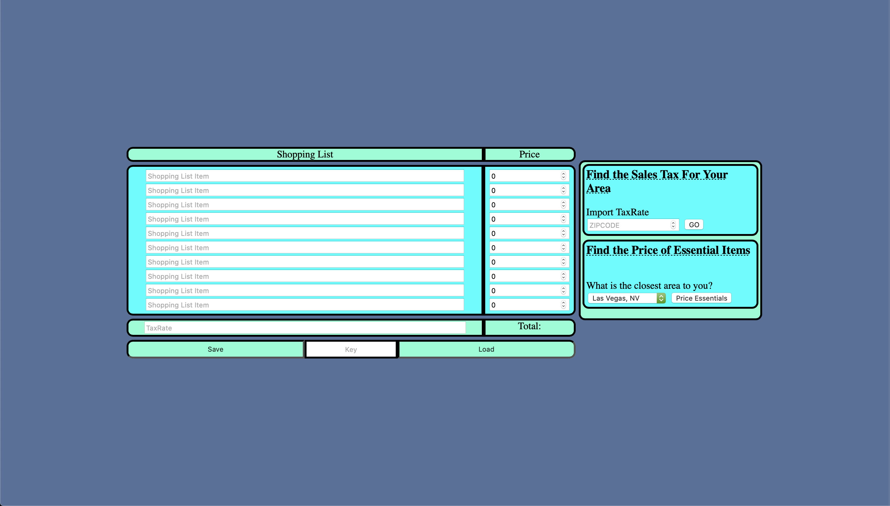
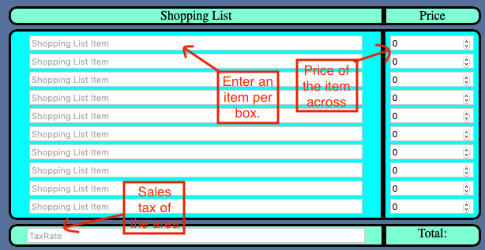
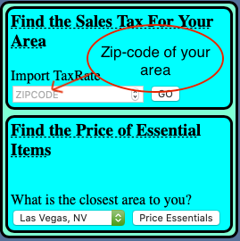

# Shopping Smart With Shaun

A website that allows you to know how much you will spend when you go grocery shopping.
You will never be short on cash again!

## What can it do

This website can:

* Take inputs for groceries
* Take inputs for prices
* Take inputs for Tax Rate
* Get Tax Rate from a Zip Code
* Find the price of some essential items in a given area
* Store and load previously used lists

### Taking inputs

You can manually enter items for your shoppin list and their prices and your total will be calculated automatically.

### Finding Tax Rate and Prices

You can input a zipcode to automatically input the taxrate for your area. You can also automatically input the prices for essential items(eggs, milk, bread, rice, steak, or butter) from the area closest to you.

### Storing and Loading Lists

Enter any text you will remeber into the textbox and hit save. When you want to get that list again enter the same key again and hit load.

## Try It

<https://shaunnnorton.github.io/SmarterShoppingWithShaun/>